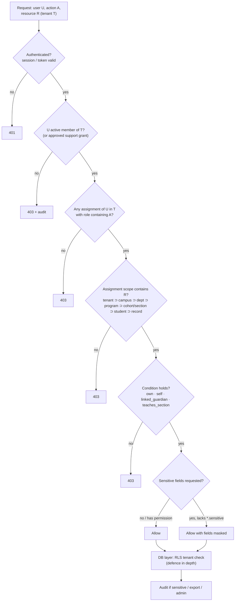

# 03 · Roles, permissions and scopes (RBAC)

RBAC is part of the **Phase A kernel**. Every module registers its permissions in one catalogue, and every request and every list query goes through one policy engine. Feature code never checks role names (`if ($user->role === 'admin')` is banned by a static-analysis rule).

## Permission model

```
Permission  = resource + action               e.g.  student.read, applicant.update, invoice.refund.approve
Role        = named bundle of permissions     e.g.  "Admissions Counselor"
Assignment  = user + role + scope             e.g.  Priya → Admissions Counselor → program:MBA (tenant: X)
Scope       = platform | tenant | campus | department | program | cohort | section | student | record
Condition   = optional relationship rule      e.g.  own (assigned_to = me), linked_guardian, self, teaches_section
Sensitivity = normal | sensitive | restricted  (field-level: e.g. health, disability, identity docs, bank details)
```

**Decision rule.** `allow(user, action, resource)` is true when **all** of the following hold:
1. The user is an active member of the resource's tenant (or a platform role acting through an approved support grant).
2. At least one assignment grants a role containing `resource.action`.
3. That assignment's scope contains the resource. Scopes are hierarchical: tenant ⊃ campus ⊃ department ⊃ program ⊃ cohort/section ⊃ student ⊃ record.
4. The permission's condition, if any, holds (for example, `own`: the lead is assigned to the user).
5. For sensitive or restricted fields, the matching `.sensitive` permission is also held; otherwise those fields are masked.
6. No explicit tenant-level deny or suspension applies. The model has no general-purpose deny rules, which keeps it simple to reason about.

**Two enforcement paths, one source of truth:**
- *Single-object checks* use policy classes that resolve the object's scope path, e.g. `student → program → department → campus → tenant`.
- *List/search queries* use a **scope filter builder** that turns the user's assignments into SQL predicates (e.g. `program_id IN (…)`, or `assigned_to = :me`). A list therefore never returns rows that the detail view would refuse.
- Both paths also sit behind tenant RLS (see [04 Multi-tenancy](04-multi-tenancy.md)), so a policy bug cannot cross tenants.

**Action vocabulary:** `read`, `create`, `update`, `delete` (soft delete), `restore`, `export`, `import`, `assign`, `approve`, `send` (communications), `publish` (results), `manage` (settings of a module), `impersonate` (never granted by default; see *Support access*).

## RBAC tables (PostgreSQL)

| Table | Key columns | Notes |
|---|---|---|
| `permissions` | `key` (e.g. `student.read`), `module`, `sensitivity`, `description` | Seeded from code; immutable at runtime |
| `roles` | `id`, `tenant_id` (NULL = system template), `key`, `name`, `is_system` | System templates are copied into each tenant; tenants may add custom roles |
| `role_permissions` | `role_id`, `permission_key`, `condition` (NULL / `own` / `self` / `linked_guardian` / `teaches_section`) | |
| `role_assignments` | `id`, `tenant_id`, `user_id`, `role_id`, `scope_type`, `scope_id`, `granted_by`, `granted_at`, `expires_at` | Time-boxed assignments supported |
| `support_access_grants` | `tenant_id`, `platform_user_id`, `approved_by`, `reason`, `starts_at`, `ends_at`, `scope` | Break-glass for platform staff |

Effective permissions are cached per `(tenant, user, assignment version)` in Redis. The cache is invalidated on any assignment or role change, and the key always includes the tenant.

## Roles

Legend for the permission columns:
- **R/C/U/D/E**: read, create, update, delete, export.
- **Comms**: send communications. **Fin**: financial actions. **AI**: AI features. **Rep**: reports. **Admin**: administrative powers.
- **Scope**: the default assignment scope.

### Platform roles (Acadlytic staff; no tenant data by default)

| Role | Dashboard | Modules | R | C | U | D | E | Comms | Fin | AI | Rep | Admin | Scope |
|---|---|---|---|---|---|---|---|---|---|---|---|---|---|
| **Platform Owner** | Business: tenants, subscriptions, platform health | Platform console (tenants, plans, billing, legal documents) | Tenant metadata only | Tenants (via provisioning) | Plans, tenant status | Suspend or close tenant (4-eyes) | Platform billing reports | Platform announcements | Platform billing | Platform AI settings, model policy | Platform KPIs | Platform settings, platform roles | Platform |
| **Platform Super Admin** | Operations: incidents, jobs, provisioning | Platform console, tenant provisioning, feature flags | Tenant metadata; **tenant data only via approved support grant** | Tenants, first Institution Owner invite | Feature flags, tenant config | — | Ops logs | — | — | Model routing, quotas | Ops metrics | Platform config (MFA and hardware key mandatory) | Platform (+ support grant scope) |

### Tenant roles (templates; tenants may clone and adjust)

| Role | Dashboard | Modules | R | C | U | D | E | Comms | Fin | AI | Rep | Admin | Scope |
|---|---|---|---|---|---|---|---|---|---|---|---|---|---|
| **Institution Owner** | Institution overview | All tenant modules | All | All | All | Soft delete (4-eyes for bulk) | All (audited) | All | View all; approve refunds | Configure, use | All | Everything in tenant, incl. roles, SSO, retention, subscription | Tenant |
| **Institution Admin** | Operations overview | All except subscription/billing and retention policy | All | All | All | Soft delete | Yes (audited) | Yes | View | Use; configure within limits | All | Users, roles (not Owner), structure, integrations | Tenant |
| **Admissions Director** | Funnel, team workload, campaign results | Admissions, Communication, Documents (admissions), Reports (admissions), AI | Leads, applicants, campaigns | Leads, applicants, campaigns, templates | Same + stages, assignments | Leads/applicants (soft) | Admissions data | Bulk and one-to-one (approval for bulk if tenant requires) | Application fees view | Assistant, drafts, segmentation | Admissions reports | Admissions settings (stages, rules) | Tenant or campus |
| **Admissions Counselor** | My leads, overdue follow-ups, my applicants | Admissions, Communication, Documents (own applicants) | Assigned (`own`) + unassigned pool in scope | Leads, notes, tasks | Own leads/applicants | — | — (request export) | One-to-one; bulk only with approval | — | Drafts, summaries | Own performance | — | Program(s) |
| **Academic Administrator** (registrar) | Enrolment status, pending verifications, results pipeline | Students, Academics, Documents, Reports | Students, programs, sections, grades | Programs, courses, sections, enrolments | Same; grade corrections with reason | Soft delete (structure) | Academic records (audited) | Academic notices | — | Summaries | Academic reports | Academic structure, grading schemes, result publication | Tenant or department |
| **Faculty / Teacher** | My sections today, attendance to take, grading queue, advisees | Academics (own sections), Students (own), Communication (own sections) | Students in own sections/advisees (`teaches_section`); no finance or sensitive fields | Attendance, grades (draft), assignments | Own entries until published | — | Own section lists | Messages to own sections | — | Drafts, summaries of own sections | Own section reports | — | Section / advisee |
| **Finance Officer** | Collections, overdue, reconciliation | Finance, Students (billing view), Reports (finance) | Fee structures, invoices, payments, billing contacts | Invoices, receipts, concessions (request) | Invoices (before posting) | Void (with reason) | Finance data (audited) | Payment reminders | Create, post, reconcile; **refund approval requires a second finance user** (separation of duties) | Summaries | Finance reports | Fee settings (if granted) | Tenant or campus |
| **Student Services Officer** | Cases, holds, document requests | Students, Documents, Communication, Guardians | Student profiles incl. `sensitive` when case-assigned | Cases, notes, holds | Contact details, holds | — | Case lists | One-to-one | View holds | Summaries | Service reports | — | Tenant or department |
| **HR / Staff Admin** | Staff directory changes | People (staff directory, faculty assignments) | Staff records | Staff records, invitations (non-privileged roles) | Staff records | Deactivate staff | Staff directory | — | — | — | Staff reports | Invite users into staff roles only | Tenant |
| **Communication Manager** | Campaign calendar, deliverability | Communication, Admissions (read) | Templates, campaigns, delivery logs, audiences | Templates, campaigns | Same | Drafts | Delivery reports | Bulk (tenant approval policy applies) | — | Drafts, subject lines | Communication analytics | Channel settings, sender identities | Tenant |
| **Analyst** | Saved dashboards | Reports, Analytics | Aggregates; row-level data in scope with PII masked unless granted | Saved reports and views | Own reports | Own reports | Aggregates; row-level only if `report.export.pii` | — | Aggregates | NL reporting | All in scope | — | Tenant or department |
| **Student** | My courses, attendance, results, fees, documents | Portal | Self (`self`); published results only | Document uploads, requests | Own contact details (if allowed) | — | Own transcript/records (where enabled) | Reply to institution messages | Pay own invoices | Portal assistant (own data only) | — | Consent and communication preferences | Student (self) |
| **Parent / Guardian** | Linked students overview | Portal | Linked students (`linked_guardian`), **only data the student and institution policy permit** | Messages, document uploads for linked minors | Own contact details | — | — | Reply | Pay linked invoices | Portal assistant (permitted data only) | — | Own preferences | Linked student(s) |
| **Read-Only / Auditor** | Audit and compliance overview | Audit Logs, Reports, read of configured modules | Configured modules (PII masked unless granted) | — | — | — | Audit exports (watermarked, audited) | — | View | — | Compliance reports | — | Tenant (time-boxed) |
| **API / Service Account** | n/a | API only | Per token scopes | Per token scopes | Per token scopes | Rarely (explicit) | Per scopes | Only via explicit scope | Only via explicit scope | Never by default | — | Never | Tenant; token-scoped; IP allow-list optional |

**Guardian access for post-secondary students.** Many post-secondary frameworks give education-record rights to the student, not the parent. FERPA, for example, transfers rights to students at post-secondary institutions. So guardian access is **off by default** and enabled per student by one of:
- (a) the student's recorded consent;
- (b) an institution policy for minors or dependants;
- (c) guardian-consent requirements for minors, e.g. under the India DPDP Act.

Which option applies is a per-institution legal decision. The platform only enforces the configured rule.

## Module × role summary (default templates)

Legend: **M** = manage (all actions), **W** = read and write, **R** = read, **O** = own or assigned only, **S** = self or linked only, **A** = approve, **—** = no access.

| Module | Inst. Owner | Inst. Admin | Adm. Director | Adm. Counselor | Acad. Admin | Faculty | Finance | Student Svc | HR | Comms Mgr | Analyst | Student | Guardian | Auditor |
|---|---|---|---|---|---|---|---|---|---|---|---|---|---|---|
| Leads & applicants | M | M | M | O | R | — | — | R | — | R | R | — | — | R |
| Students | M | M | R | O | M | O | R (billing) | W | — | R | R (masked) | S | S | R |
| Guardians | M | M | R | O | W | — | R (billing) | W | — | R | — | S | S | R |
| Academics | M | M | — | — | M | O | — | R | — | — | R | S | S | R |
| Attendance | M | M | — | — | M | O | — | R | — | — | R | S | S | R |
| Exams & results | M | M | — | — | M + A (publish) | O (draft) | — | R | — | — | R | S (published) | S (permitted) | R |
| Documents | M | M | W | O | M | O | R (finance docs) | W | — | — | — | S | S | R |
| Communication | M | M | W | O | W | O | O (reminders) | W | — | M | R | S | S | R |
| Finance | M + A | R | R (app fees) | — | — | — | M (refund A by 2nd user) | R (holds) | — | — | R | S | S | R |
| Reports & analytics | M | M | W (admissions) | O | W (academic) | O | W (finance) | W | R | W (comms) | M | — | — | R |
| AI Center | M | W | W | O | W | O | W | W | — | W | W | S | S | R (usage) |
| Automation | M | M | W (admissions) | — | W (academic) | — | W (finance) | — | — | W | — | — | — | R |
| Integrations | M | M | — | — | — | — | — | — | — | — | — | — | — | R |
| Administration (users, roles, SSO) | M | W (not Owner) | — | — | — | — | — | — | W (staff invites) | — | — | — | — | R |
| Audit logs | R + E | R | — | — | — | — | — | — | — | — | — | — | — | R + E |

## Special rules

- **Least privilege.** New users get no role until one is assigned. Invitations must name a role and scope.
- **Separation of duties.** Refund approval, result publication, and role changes to admin level need a second authorised user. Bulk deletes and exports above a threshold need approval.
- **Sensitive fields** (health, disability, identity documents, bank details, disciplinary notes) need `*.sensitive.read`. Otherwise they are masked in the UI, API, exports and AI context.
- **Support access** (platform staff) is none by default. It needs a tenant-approved, time-boxed `support_access_grant` with a reason, scoped read-only unless write is explicitly approved. Every action is audited and visible to the tenant.
- **Service accounts** use scoped API tokens (`students:read`, `leads:write`, …), bound to one tenant, with expiry and rotation, never administrative, and optionally IP-restricted.
- **Access reviews.** A quarterly access-review report per tenant (who has what, last used), with one-click revoke.
- **Custom roles** are assembled only from the permission catalogue; there is no code per tenant.

## RBAC evaluation



**Testing:** a generated test matrix (role × permission × scope, positive and negative) runs in CI. Adding a permission without tests fails the build.
