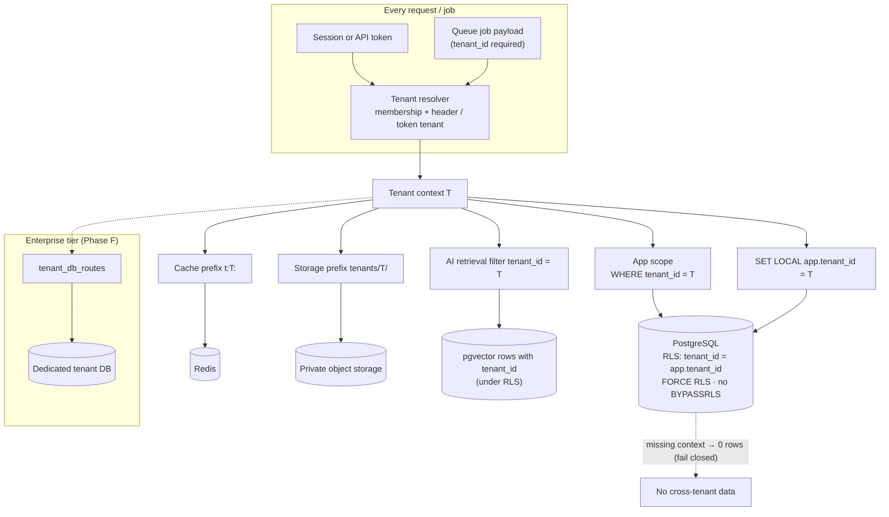

# 04 · Multi-tenant architecture

A **tenant** is one institution (or one institution group that shares records). Every tenant-owned resource carries a non-null `tenant_id`, and nothing crosses that boundary.

## Options compared

| Criterion | A. Shared database, `tenant_id` column | B. Shared database, schema per tenant | C. Database per tenant |
|---|---|---|---|
| Isolation strength | Logical. Strong **only with** RLS plus app scoping. | Logical, stronger namespace separation | Physical: strongest |
| Operational cost | Lowest: one DB, one migration run | High: migrations × N schemas, catalogue bloat past ~1,000 schemas | Highest: N databases, N backups, N connection pools |
| Cross-tenant analytics (platform ops) | Easy (metadata only) | Harder | Hardest |
| Noisy neighbour | Must be managed (limits, budgets) | Same database resources | Isolated |
| Per-tenant backup/restore | Needs logical export per tenant | Per-schema dump possible | Native |
| Data residency per tenant | Per region deployment | Per region deployment | Can place DB in any region |
| Fit for MVP (few tenants, small team) | **Best** | Poor | Poor |
| Fit for large enterprise tenants | Acceptable with limits | Acceptable | **Best** |

## Recommendation

**Start with A (shared database + `tenant_id`), enforced by PostgreSQL row-level security (RLS) *and* an application tenant scope.** Build a **tenant → database connection routing table** from day one, so that any tenant can later move to **C (dedicated database)** as an enterprise tier (Phase F) without code changes. Skip B: it has most of the cost of C and little of the benefit.

### How isolation is enforced (defence in depth)

1. **Tenant resolution (edge of the app).** Every authenticated request resolves exactly one tenant, from the session membership plus the validated `X-Acadlytic-Tenant` header, or from the API token's tenant. Requests without a resolved tenant can reach only non-tenant endpoints (login, tenant picker).
2. **Application scope.** A global Eloquent scope adds `tenant_id = :current` to every tenant-owned model. Writes set `tenant_id` automatically and reject mismatches. Models without `tenant_id` must be explicitly marked `PlatformScoped` and are reviewed.
3. **Database RLS (fail closed).**
   - Every tenant table has `ENABLE ROW LEVEL SECURITY` and `FORCE ROW LEVEL SECURITY`, with the policy `tenant_id = current_setting('app.tenant_id')::uuid`.
   - The app sets `SET LOCAL app.tenant_id` at the start of every transaction.
   - The application's database role is **not** the table owner and has no `BYPASSRLS`. If the setting is missing, queries return **zero rows** rather than all rows.
4. **Background jobs.** Every job payload carries `tenant_id`. The worker middleware sets the DB setting, cache prefix and storage prefix before the job body runs. Jobs without a tenant fail.
5. **Cache.** Keys are prefixed `t:{tenant_id}:…` by a wrapper. The raw Redis client is not exposed to feature code.
6. **Search.** PostgreSQL full-text search runs inside RLS. The later external search index (Phase F) uses one index per tenant or a mandatory tenant filter injected by the search adapter.
7. **Files.** Object keys are `tenants/{tenant_id}/{module}/{uuid}`, and there is no public bucket. Downloads go through the API (policy check + audit), then a short-lived signed URL scoped to that single object.
8. **Exports.** Generated into a tenant prefix, available only to the requesting user, expire after a set time, and every download is audited.
9. **AI context.** Retrieval queries run under RLS with the tenant embedded in the query. Vector rows carry `tenant_id`. Prompts are assembled only from the permitted results for that user. Provider requests carry no cross-tenant data, and responses are never cached across tenants.
10. **Logs and telemetry.** Include `tenant_id` for traceability, but never raw sensitive fields (PII redaction in the log pipeline).
11. **Tests.** A tenant-isolation suite creates two tenants with identical data and asserts that no endpoint, list, search, export, job, cache read, file download or AI retrieval of tenant A returns tenant B data. It is mandatory in CI.

### Tenant data layout

| Kind | Examples | Location |
|---|---|---|
| Platform-level | `tenants`, `plans`, `platform_users`, `tenant_domains`, `tenant_db_routes`, `permissions` | Shared tables without RLS, platform roles only |
| Tenant-owned | Everything institutional: students, applications, documents, invoices, messages, audit events | Shared tables with `tenant_id` and RLS |
| Global identities | `users` (a person can belong to several tenants) | Shared; memberships in `tenant_memberships (tenant_id, user_id, status)` |

### Evolution path

| Stage | Isolation | Trigger |
|---|---|---|
| MVP | Shared DB + RLS, single region | Default for all tenants |
| Growth | Same; plus per-tenant rate limits, query budgets, queue fairness | Noisy-neighbour signals, larger tenants |
| Enterprise | **Dedicated database** (same schema) for tenants that contract for it, via `tenant_db_routes`. Optionally a dedicated region for residency. | Contract requirement, or data volume above a threshold |
| Later | Dedicated compute pools for very large tenants | Measured need |

Moving a tenant to a dedicated database means: logical export (tenant-filtered) → import into the new DB → a short write freeze → switch the route → verify → purge from shared. This is rehearsed in staging before it is offered.

## Tenant isolation diagram

