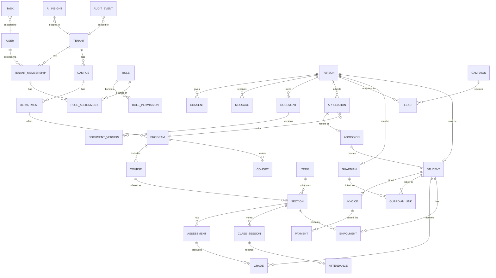
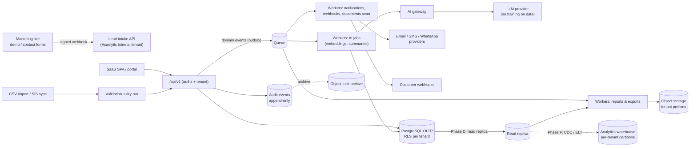

# 05 · Data architecture and domain model

## Conventions (every table)

| Concern | Convention |
|---|---|
| Primary key | `id uuid` using **UUIDv7**: time-ordered for index locality, non-guessable, safe to expose in URLs. There are no sequential IDs in public interfaces. |
| Tenant boundary | `tenant_id uuid NOT NULL REFERENCES tenants(id)` on every tenant-owned table, first column of composite indexes, RLS policy (see [04](04-multi-tenancy.md)). Foreign keys between tenant tables are **composite `(tenant_id, id)`**, so a row can never reference another tenant's row. |
| Timestamps | `created_at`, `updated_at timestamptz NOT NULL`, stored in UTC and shown in the tenant's time zone |
| Actors | `created_by`, `updated_by uuid NULL` (user or service account) |
| Soft deletion | `deleted_at timestamptz NULL` on business records (people, applications, documents, invoices). Hidden by default scope; restorable within the retention window. **Hard deletion** happens only through the retention engine or a verified erasure request, and is logged. |
| Concurrency | `version integer` for optimistic locking on records edited by several people (grades, applications) |
| Audit | Changes to sensitive entities emit audit events with before and after diffs (sensitive values hashed or masked). See [08](08-security-privacy.md#audit-logging). |
| Status fields | Constrained enums or lookup tables, with history tables where state transitions matter (`application_stage_history`, `student_status_history`) |
| Money | `amount_minor bigint` + `currency char(3)`; never floats |
| PII classification | Column-level tags in the schema registry: `pii`, `sensitive`, `restricted`. They drive masking, export controls, AI eligibility and retention. |
| Encryption | Disk-level encryption at rest everywhere. **Application-level encryption** (envelope keys per tenant) for restricted fields such as government ID numbers, bank details and MFA secrets. |

## Domain model by module (bounded contexts)

| Module | Entities (key fields) | Owner of data |
|---|---|---|
| **Platform** | `tenants` (slug, name, region, plan, status), `tenant_domains`, `tenant_db_routes`, `plans`, `platform_users` | Acadlytic |
| **Identity & access** | `users` (email, name, password_hash, mfa), `tenant_memberships` (tenant, user, status), `roles`, `permissions`, `role_permissions`, `role_assignments`, `api_tokens`, `sessions`, `support_access_grants` | Acadlytic (identity), tenant (memberships) |
| **Institution structure** | `campuses`, `departments`, `programs` (code, level, duration), `academic_years`, `terms`, `cohorts` (program, intake term) | Tenant |
| **People** | `persons` (legal name, preferred name, DOB, contacts: the shared identity of a human within a tenant), `students` (person, student_no, status, program, cohort), `guardians` (person), `guardian_links` (student, guardian, relationship, access_level, consent_ref), `staff` (person, user, department, title) | Tenant |
| **Admissions CRM** | `leads` (person, source, campaign, owner, stage, score), `campaigns`, `sources`, `applications` (person, program, intake term, stage, decision), `application_stage_history`, `offers`, `admissions` (accepted offer → enrolment hand-off) | Tenant |
| **Enrolment & academics** | `enrolments` (student, program/section, term, status), `courses` (code, credits), `sections` (course, term, faculty, capacity, schedule), `class_sessions` (section, starts_at), `attendance_records` (session, student, status), `assessments` (section, type, weight), `grades` (assessment, student, score, status draft/published), `assignments`, `submissions` | Tenant |
| **Communications** | `templates` (channel, locale, body, approval), `messages` (channel, to, status, provider_id), `campaign_sends`, `delivery_events`, `consents` (person, channel, purpose, basis, captured_at, source), `suppressions` (opt-outs, bounces) | Tenant |
| **Documents** | `documents` (owner entity, type, classification, status, retention_class), `document_versions` (object_key, sha256, size, mime, scan_status), `document_access_events` | Tenant |
| **Finance** | `fee_structures`, `fee_items`, `invoices` (student/applicant, due, status), `invoice_lines`, `payments` (gateway, gateway_ref, status), `refunds` (approved_by), `concessions`, `ledger_entries` (double-entry, immutable) | Tenant |
| **Work & automation** | `tasks` (subject entity, assignee, due), `notes`, `activities` (timeline), `workflows` (trigger, conditions, actions, approval), `workflow_runs` | Tenant |
| **Notifications** | `notifications` (user, type, payload, read_at), `notification_preferences` | Tenant |
| **Reporting** | `report_definitions`, `saved_views`, `report_runs` (params, status, output object key, expires_at) | Tenant |
| **AI** | `ai_interactions` (user, feature, model, prompt_template_version, token usage, outcome), `ai_insights` (subject entity, type, content, sources, status suggested/accepted/rejected), `ai_embeddings` (source entity, chunk, vector, **tenant_id**), `prompt_templates` (platform-managed) | Tenant (interactions and insights), Acadlytic (templates) |
| **Integrations** | `integrations` (provider, config, encrypted credentials ref), `webhook_endpoints`, `webhook_deliveries`, `import_jobs`, `integration_logs`, `idempotency_keys` | Tenant |
| **Audit & privacy** | `audit_events` (append-only, partitioned), `data_subject_requests` (type, subject, status, due_at), `legal_holds`, `retention_policies` | Tenant (events), Acadlytic (platform audit) |
| **Marketing leads (Acadlytic's own)** | The website's `enquiries` flow into Acadlytic's **own internal tenant** in the platform (dogfooding), not into any customer tenant | Acadlytic |

## Core entity relationships

*Every entity except USER, ROLE (system templates) and PERMISSION carries `tenant_id`. USER is global because one person may work for several tenants. Their access is always through a TENANT_MEMBERSHIP.*

## Data flow

The **transactional outbox** pattern means events are written in the same transaction as the business change, then published by a relay. No event is lost or sent for a rolled-back change.

## Retention considerations

Retention periods are **set per institution**, because they depend on the institution's legal obligations. The platform provides the mechanism. Values below are **placeholders to be configured**, not recommendations or legal advice.

| Data class | Examples | Mechanism | Default until configured |
|---|---|---|---|
| Prospect data | Leads that never applied | Retention class `prospect`; purge or anonymise after the configured period of inactivity | Configurable; flagged for review |
| Applicant data (not enrolled) | Applications, documents | Class `applicant_unsuccessful` | Configurable |
| Student records | Enrolment, grades, transcripts | Class `student_record` (often long-lived) | Retained until policy set |
| Financial records | Invoices, payments, ledger | Class `financial`; ledger entries immutable | Retained until policy set |
| Communications | Messages, delivery logs | Class `communication` | Configurable |
| Audit events | Security and access logs | Class `audit` (partitions archived to object-lock storage) | Retained until policy set |
| AI interactions | Prompts and outputs metadata | Class `ai_interaction`; minimise stored prompt text | Configurable |

**Legal holds** override retention for the scoped records. Erasure requests produce **anonymisation**: identity fields are replaced and aggregates keep working. Where records must be kept by law, the request is recorded as *restricted* instead.
