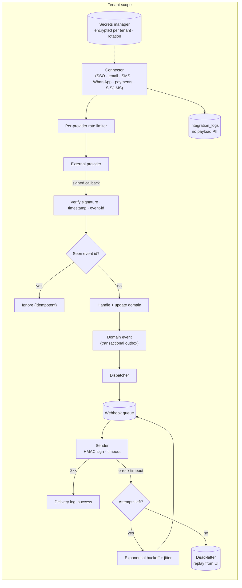

# 06 · API and integration architecture

## 15. API architecture

**API-first.** The SPA, the portal and (from Phase F) external clients use the same versioned contracts. Internal endpoints are designed like public ones from day one; they are simply not published until Phase F.

| Concern | Design |
|---|---|
| Base path | `https://app.acadlytic.com/api/v1/` (same origin as the SPA, which avoids CORS for first-party use). Phase F may add a public host `api.acadlytic.com/v1/` fronting the same handlers. |
| Versioning | Major version in the path (`/v1/`). Additive changes only within a version. Breaking changes → `/v2/` with a documented deprecation window and `Deprecation`/`Sunset` headers. |
| Style | REST resources, JSON, `snake_case` fields, ISO-8601 UTC timestamps, UUID identifiers |
| Authentication | First-party SPA: **session cookie** (HttpOnly, Secure, SameSite=Lax) + CSRF token. Integrations: **OAuth 2.0 client credentials** or **personal/service API tokens** (hashed at rest, prefix-identifiable, expiring, tenant-bound, scoped). No tokens in URLs. |
| Authorisation | Policy engine on every endpoint (see [03 RBAC](03-rbac.md)); token scopes intersect with the service account's role permissions |
| Tenant | From session membership + `X-Acadlytic-Tenant` (validated), or the token's bound tenant. Never from the request body. |
| Pagination | Cursor-based: `?limit=50&cursor=…`, response `meta.next_cursor`. Max limit 200. |
| Filtering and sorting | `?filter[stage]=offer&filter[program_id]=…&sort=-created_at`; only allow-listed fields |
| Sparse fields and includes | `?fields[students]=id,name&include=guardians` (allow-listed, authorisation-checked per include) |
| Validation | Request objects with declared rules; unknown fields rejected on write |
| Errors | RFC 9457 *problem details*: `{ "type", "title", "status", "detail", "instance", "errors": {field: [..]}, "trace_id" }`. No stack traces or SQL in responses. |
| Idempotency | `Idempotency-Key` header required on POSTs that create money movements, messages or imports; stored 24h per tenant+key with the response replayed on retry |
| Concurrency | `ETag`/`If-Match` on updates of versioned resources → `412` on conflict |
| Rate limiting | Per token/user and per tenant (Redis sliding window); `429` with `Retry-After` and `RateLimit-*` headers; stricter limits on auth, export and AI endpoints |
| Bulk and long jobs | `202 Accepted` + job resource (`/api/v1/jobs/{id}`) for imports, exports, reports and AI batch jobs |
| Webhooks | See below |
| Documentation | OpenAPI 3.1 generated from code and request classes, contract-tested in CI; published developer docs in Phase F (FUTURE) |
| Observability | `trace_id` on every response; structured access logs without bodies |

Example resources (v1): `/me`, `/me/permissions`, `/tenants/current`, `/leads`, `/applications`, `/applications/{id}/stage-transitions`, `/students`, `/students/{id}/guardians`, `/sections/{id}/attendance`, `/assessments/{id}/grades`, `/documents`, `/documents/{id}/download-url`, `/messages`, `/invoices`, `/payments`, `/reports/{key}/runs`, `/ai/assistant/conversations`, `/ai/insights`, `/webhook-endpoints`, `/audit-events`, `/jobs/{id}`.

## 14. Integration architecture

Integration categories and their status (all **PLANNED or FUTURE**; no provider is contracted and no connector exists):

| Category | Examples of approach | Status |
|---|---|---|
| Identity providers (SSO) | SAML 2.0, OIDC (e.g. Microsoft Entra ID, Google Workspace), SCIM user provisioning later | PLANNED (F) |
| Email | Transactional email provider via SMTP/API adapter; SPF/DKIM/DMARC per sending domain | PLANNED (B) |
| SMS | SMS provider adapter (India: DLT template registration required) | PLANNED (B/D) |
| WhatsApp | WhatsApp Business Platform via a BSP; approved templates; opt-in records | PLANNED (D) |
| Payment gateways | Hosted checkout / tokenised payments, webhooks for settlement; no card data touches Acadlytic | PLANNED (D) |
| Calendar | ICS feeds first; Google/Microsoft calendar sync later | FUTURE |
| Storage | S3-compatible object storage (internal); customer storage export later | PLANNED (B) |
| SIS / LMS / ERP | CSV import/export first; then connectors per named customer demand (e.g. LTI 1.3 for LMS) | FUTURE |
| Analytics / BI | Scheduled exports; warehouse share later | FUTURE |
| AI services | LLM providers behind the AI gateway (see [07](07-ai-architecture.md)) | PLANNED (E) |

### Framework components

| Component | Design |
|---|---|
| Connector interface | Every integration implements `Connector` (auth, capabilities, sync jobs, health check) in the Integrations module; the domain never calls vendor SDKs directly |
| Credentials | Stored in the secrets manager or encrypted per tenant (envelope encryption); only a reference in DB; **rotation** supported with two active versions during cut-over |
| Auth types | API keys (inbound, hashed), OAuth 2.0 (outbound to providers; tokens encrypted, refresh handled centrally), HMAC-signed webhooks |
| Outbound webhooks | Events from the outbox (e.g. `application.stage_changed`, `student.created`, `payment.succeeded`); signed `X-Acadlytic-Signature: t=…,v1=HMAC-SHA256(secret, t.body)`; at-least-once delivery; exponential backoff (e.g. 1m → 24h, bounded attempts); **dead-letter** after final failure with replay from the UI; endpoints auto-disabled after sustained failures and the tenant is notified |
| Inbound webhooks (from providers) | Signature verification, timestamp tolerance, replay protection via event ID store, idempotent handlers |
| Idempotency | Idempotency keys on inbound events and outbound calls; unique constraints on provider references (e.g. `payments.gateway_ref`) |
| Retry and DLQ | Job-level retries with jitter; poison messages → dead-letter table with reason; operator replay |
| Rate limits | Per-provider token buckets so one tenant's sync cannot exhaust shared provider quotas |
| Logs | `integration_logs` per tenant (request summary, status, latency, error class; **no payload PII**), retained per policy |
| Imports | Upload → schema mapping → **dry run** with validation report → approve → apply in batches → per-row results; reversible where feasible |

