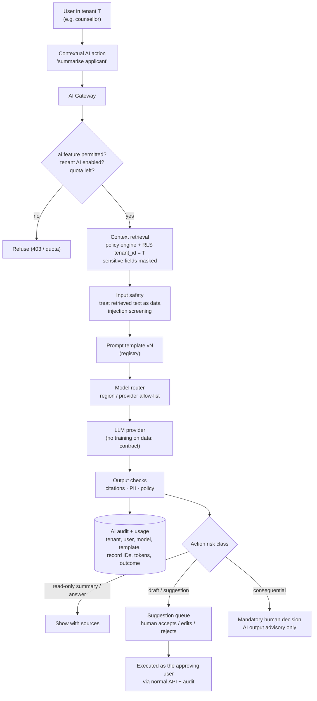

# 07 · AI architecture

All AI capabilities are **PLANNED (Phase E) or FUTURE**. None is live. The AI layer is a module (`AI`) inside the monolith with its own queue workers. It sits behind one **AI gateway**, so provider choice, safety, tenant isolation, audit and cost control live in one place.

## Components

| Component | Responsibility |
|---|---|
| **AI Gateway** | The single entry point for every AI call. Authenticates the caller, checks `ai.*` permissions and tenant AI settings, applies quotas, assembles context, calls the model router, runs output checks, writes the AI audit record. |
| **Model Router** | Picks a model per task by capability, data-sensitivity policy, latency and cost, e.g. small, fast model for classification and larger model for summarisation. Supports fallback providers. Enforces region and provider allow-lists per tenant. |
| **Prompt Management** | Versioned prompt templates (`prompt_templates`: key, version, owner, eval score, status). Released through review like code. Each interaction records the template version. Tenants may add instructions (tone, terminology) but not replace safety sections. |
| **Context Retrieval** | Retrieval-augmented generation over **permitted** tenant data. Structured queries go through the same policy engine as the API. Semantic search uses `pgvector` embeddings with `tenant_id` under RLS. Sensitive fields are excluded unless the user holds `*.sensitive.read` and the feature is approved for sensitive data. |
| **Tenant Isolation** | Tenant context is set before retrieval (RLS). The prompt builder accepts only objects returned by that call. Responses and caches are keyed by tenant and user. Provider contracts must exclude training on customer data (to be contracted; see risks). |
| **Tool / action layer** | AI may *propose* actions (create task, draft message, set tag). Each tool is a normal API command, permission-checked as the invoking user, and marked by risk class (below). |
| **AI Audit Log** | `ai_interactions`: tenant, user, feature, template version, model and provider, token counts, latency, retrieved record IDs (not contents), safety flags, outcome (accepted / edited / rejected). Prompt and response text is stored only where the tenant enables it, with retention. |
| **Usage Tracking** | Per tenant, user and feature metering (requests, tokens, cost). Quotas and budgets with soft and hard limits. Visible in the AI Center. |
| **Model Evaluation** | Offline evaluation sets per feature (synthetic or consented data, never cross-tenant): groundedness, accuracy, refusal behaviour, bias checks across cohorts. Regression gate before a prompt or model change ships. |
| **Safety Controls** | Input screening (prompt injection patterns in retrieved content, PII in free text where not needed), output checks (PII leakage, unsupported claims, toxicity), citation requirement for factual answers, and a kill switch per feature and per tenant. |
| **Human Approval Workflows** | An `ai_insights` / suggestions queue with states suggested → accepted / edited / rejected. High-impact actions require explicit human approval by a permitted user, and the approval is audited. |

## What AI may do, and when a human must approve

| Capability | AI may | Human approval |
|---|---|---|
| Summarise a record, thread or report | **Summarise** (with sources) | Not required (read-only output shown to a permitted user) |
| Answer questions about permitted data | **Answer** with citations | Not required; answers are advisory |
| Classify documents, enquiries, tickets | **Classify** and propose tags or routing | Required before the classification changes a decision-relevant field (e.g. document *verified*) |
| Draft emails, SMS, WhatsApp messages | **Draft** | **Always** before sending; bulk sends also follow communication approval rules |
| Segment students or leads | **Suggest** segments | Required before a segment is used for outreach |
| Recommend next actions | **Recommend** | Required before any action is executed |
| Automate low-risk, reversible steps | **Automate** only for pre-approved, reversible, non-consequential steps configured by an admin (e.g. create a follow-up task, add an internal tag) | Configured once by an authorised admin; each run is logged and reversible |
| Admission decisions, grades, results, disciplinary outcomes, financial aid, fee waivers, account suspension | **Never decides.** May summarise inputs for a human. | **Mandatory**, and AI output is not the sole basis |
| At-risk identification (FUTURE) | Flag *for review* with explanation and confidence | Mandatory human review; no automated consequences; fairness evaluation before enablement |

Institutions can switch off any AI feature, and AI is **off by default** for student and guardian portals until the institution enables it.

## AI request flow

## AI data rules

1. Never mix tenants in a prompt, cache, embedding index, fine-tune or evaluation set.
2. No fine-tuning on customer data without a separate written agreement and a per-tenant model.
3. Minimum necessary context. Sensitive and restricted fields are excluded by default.
4. Keep embeddings in PostgreSQL (`pgvector`) under RLS until scale requires a dedicated vector store. The replacement must support mandatory tenant filters.
5. The data-subject request tooling covers AI artefacts (insights, stored prompts and outputs, embeddings of the subject's records).
6. The AI provider list appears on the sub-processor register before any tenant data is sent (none contracted today).
