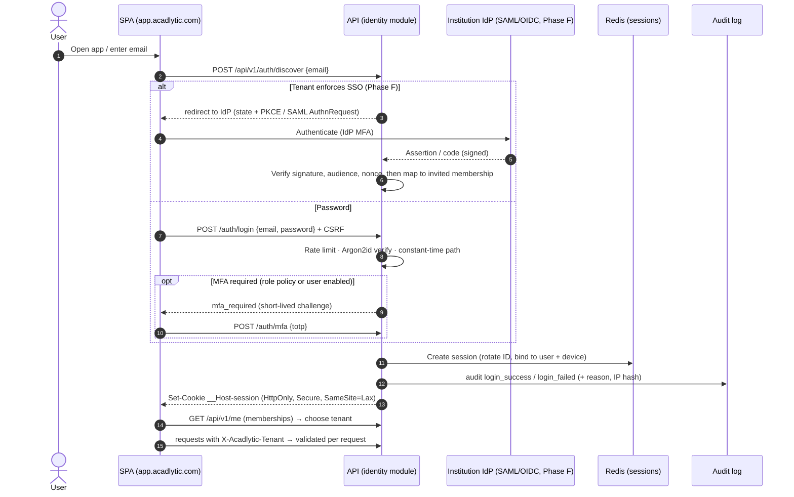

# 08 · Security, privacy/compliance and audit architecture

## Security architecture: defence in depth

| Layer | Control | Design |
|---|---|---|
| Transport | TLS everywhere | TLS 1.2+ (prefer 1.3) at the edge; HSTS with preload once stable; TLS to the database, Redis and providers inside the VPC |
| Edge | WAF, DDoS, bot controls | Managed CDN/WAF in front of `app.` and `acadlytic.com`; rate limits for auth and forms |
| Identity | Password hashing | **Argon2id** (tuned parameters), rehash on login, breached-password check (k-anonymity API or local list) |
| Identity | MFA | TOTP in Phase A, **mandatory** for platform roles, Institution Owner/Admin, Finance and Academic Admin; WebAuthn/passkeys in Phase F; recovery codes (hashed) |
| Identity | SSO-ready | Identity abstraction supporting SAML 2.0 and OIDC per tenant (Phase F); JIT provisioning mapped to invited memberships only; SCIM later |
| Sessions | Session security | Server-side sessions in Redis; `__Host-` cookies, `HttpOnly`, `Secure`, `SameSite=Lax`; rotation on login and privilege change; idle (e.g. 30 min) and absolute timeouts; device list with revoke |
| App | Authorisation | Policy engine (RBAC + scopes) + RLS (see [03](03-rbac.md), [04](04-multi-tenancy.md)); non-sequential IDs |
| App | CSRF | Synchroniser/double-submit tokens for cookie-authenticated requests; `SameSite` as a second layer |
| App | Rate limiting / throttling | Redis sliding windows per IP, user, token and tenant; progressive delays and lockout for login; stricter for exports and AI |
| App | Input validation | Request classes with allow-listed fields and types; server-side always |
| App | Output encoding | React auto-escaping; no `dangerouslySetInnerHTML` without a sanitiser (DOMPurify) for rich text; contextual encoding in PDFs and emails; CSV formula-injection protection on exports |
| App | Security headers and CSP | Strict CSP (nonces or hashes, no `unsafe-inline`), `frame-ancestors 'none'`, COOP, Referrer-Policy, Permissions-Policy, `nosniff`; same baseline as the current website |
| Files | Secure uploads | Size limits, extension + MIME + magic-byte allow-list, quarantine bucket, **malware scanning** (e.g. ClamAV worker or a managed scanner) before release, image re-encoding, PDF active-content stripping (see [09](09-documents-comms-reporting.md)) |
| Data | Encryption at rest | Provider-managed disk encryption for DB, backups, object storage and Redis snapshots; **application-level envelope encryption** for restricted fields (per-tenant data keys wrapped by a KMS key) |
| Data | Key management | Cloud KMS; key rotation policy; separate keys per environment; per-tenant data keys enable crypto-shredding on tenant exit |
| Secrets | Secrets management | Cloud secrets manager; short-lived credentials via workload identity; no secrets in the repository or images; secret scanning in CI and pre-commit |
| Backups | Backup encryption | Encrypted with KMS keys; separate account or project for backup copies; restore tests (see [10](10-infrastructure-operations.md)) |
| Supply chain | Dependency scanning | Composer and npm audit, SCA (Dependabot or equivalent), lockfiles, SBOM generation, pinned base images, image scanning |
| Code | SAST / review | PHPStan (max level) + security rules, ESLint security, mandatory review, protected branches |
| Infra | Hardening | Private subnets for data stores; no public DB endpoints; least-privilege IAM; infrastructure as code (Terraform/OpenTofu) with review; CIS-aligned images |
| Vuln mgmt | Vulnerability management | Patch SLAs by severity, container rebuilds weekly, external penetration test before first tenant with real data and annually, `security.txt` + disclosure policy |
| Detection | Audit and alerts | Audit log (below), security alerts (see [10](10-infrastructure-operations.md#observability)) |
| Response | Incident response | Runbook: triage → contain → eradicate → recover → notify (per contract and law) → post-mortem; roles and contact tree; tabletop exercise twice a year |

## Authentication

## Privacy and compliance architecture

**Status:** Acadlytic is **not certified or attested** under any framework, and makes **no claim of legal compliance**. The platform is *architecture designed to support* institutions' obligations under frameworks such as FERPA (US), GDPR and UK GDPR (EU/UK), the Digital Personal Data Protection Act 2023 (India), and SOC 2-oriented control objectives. Compliance and attestation require legal review, operating evidence and, for SOC 2, an independent audit. None of this exists yet.

| Principle / right | Platform support |
|---|---|
| Roles | Default model: the **institution is the controller / data fiduciary** for its student and applicant data; **Acadlytic is the processor**, acting on documented instructions (DPA). Acadlytic is controller for its own website and marketing data. *To be confirmed by counsel in contracts.* |
| Data minimisation | Field catalogue with PII classification; optional fields off by default; no collection without a mapped purpose |
| Purpose limitation | Purpose tags on consents and communication types; AI features declare the data classes they use |
| Consent (where applicable) | `consents` records: person, purpose, channel, lawful basis, captured_at, source, evidence; withdrawal is as easy as giving; guardian consent capture for minors (e.g. DPDP verifiable parental consent) |
| Access requests | Data-subject request workflow: verify identity → compile export (JSON/PDF) across modules including documents and AI artefacts → institution approves → deliver via secure link |
| Correction | Request → routed to the data owner → change audited |
| Deletion | Erasure = anonymisation with referential integrity; blocked or partially applied where a legal hold or statutory retention applies, with the reason recorded |
| Retention | Retention classes per data type, configured per institution; scheduled jobs apply them; reports of what was purged |
| Legal holds | `legal_holds` suspend retention and erasure for scoped records; audited |
| Audit trails | See below |
| Sub-processors | Register (hosting, email, SMS, WhatsApp, AI, payments, monitoring) with purpose, data categories and region; public page and change notifications. **Currently none contracted.** |
| DPAs | DPA template with SCCs / IDTA where transfers apply, security annex mapping to these controls |
| Data residency | Region chosen per deployment. Indian institutions: India region. EU/UK tenants would need an EU/UK deployment before onboarding. No residency is claimed until deployed. |
| Cross-border transfers | Minimised; AI and messaging providers chosen with in-region processing where available; transfer mechanisms documented per sub-processor |
| Breach response | Detection → assessment → containment → notification to affected institutions without undue delay per contract (institutions notify regulators and individuals as controllers, with Acadlytic support) → post-incident review |
| Children's data | Age or minor flag on persons; guardian links and consent; restricted AI and profiling features for minors |
| FERPA-specific | Access logging supports disclosure records; directory-information flags per student; the institution controls disclosures |

## Audit logging

Every security-relevant or sensitive-data action is written to `audit_events`, append-only.

| Field | Content |
|---|---|
| `id` | UUIDv7 |
| `tenant_id` | Tenant (NULL for platform events) |
| `occurred_at` | UTC timestamp |
| `actor_type` / `actor_id` | user, service account, system, platform staff (with support grant id) |
| `ip_hash`, `user_agent`, `session_id_hash` | Network and device context (hashed where personal) |
| `action` | e.g. `auth.login_failed`, `role.assigned`, `student.viewed_sensitive`, `export.created`, `document.downloaded`, `invoice.voided`, `ai.suggestion_accepted` |
| `resource_type` / `resource_id` | Affected entity |
| `before` / `after` | JSON diffs for changes (sensitive values masked or hashed) |
| `outcome` | success / denied / failed + reason |
| `request_id` / `trace_id` | Correlation |
| `prev_hash` / `hash` | Hash chain per tenant partition (tamper evidence) |

**Always logged:** logins (success, failure, lockout), MFA changes, password resets, session revocations, permission and role changes, support-access grants and use, student-record views of sensitive fields, all exports and downloads, financial changes (create, void, refund, approval), result publication, AI suggestions accepted or rejected and automated AI actions, administrative and settings changes, integration credential changes, and data-subject requests.

**Storage:**
- The table is monthly-partitioned. The app DB role has `INSERT` only; no `UPDATE` or `DELETE` grant.
- Hash chaining makes tampering evident.
- Growth stage: partitions are periodically exported to **object-lock (WORM)** storage.
- Tenants can search and export their own audit log (auditor role); platform staff see platform events.
