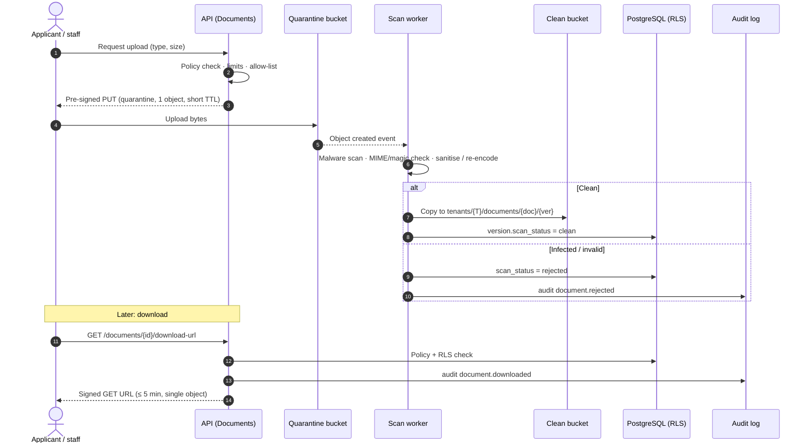

# 09 · Documents, communications and reporting

## 11. Document architecture

Documents (transcripts, identity proofs, certificates, fee receipts, offer letters) are among the most sensitive data. They **never** live in a public web directory, and are never reachable by a predictable URL.

| Requirement | Design |
|---|---|
| Private storage | S3-compatible buckets with *block public access*, bucket policy denying anything except the app's role; separate **quarantine** and **clean** buckets |
| Tenant isolation | Object key `tenants/{tenant_id}/documents/{document_id}/{version_id}` (UUIDs, no filenames in keys); IAM conditions on prefixes where the provider supports them; metadata rows under RLS |
| Access control | `documents` rows carry owner entity (person/application/invoice), type and classification; policy engine decides; guardians and students only see documents shared to the portal |
| Virus / malware scanning | Upload → quarantine → scan worker (ClamAV or managed scanner) → clean bucket; infected files blocked, uploader notified, audit event |
| Validation | Size limits per type; extension + MIME + magic-byte allow-list (PDF, JPEG, PNG, DOCX as configured); images re-encoded (strips metadata/EXIF location); PDFs flattened/sanitised where active content found |
| Metadata | Type, classification (`normal`/`sensitive`/`restricted`), issuer, expiry, verification status, checksum (SHA-256), size, uploaded_by |
| Versioning | Immutable `document_versions`; replacing creates a new version; previous versions retained per retention class |
| Expiry | Optional `expires_at` (e.g. visa, ID) → reminders and verification tasks |
| Retention | Retention class per document type; retention engine purges versions and objects; legal holds override |
| Download audit | Every view/download → `document.downloaded` audit event (who, what, when, IP hash) |
| Access audit | Permission denials and share changes audited |
| Signed URLs | API checks policy → issues a **short-lived (e.g. ≤ 5 min), single-object, GET-only** signed URL, content-disposition set; or streams through the app for highest sensitivity |
| Watermarking | Optional dynamic watermark on exported/downloaded PDFs of restricted documents (name, time, user) |
| OCR-ready | Async OCR job writes text layer to a separate, access-controlled store; OCR text inherits the document's classification |
| Classification | Rule-based first (by upload slot/type); AI-assisted classification (Phase E) proposes, human confirms |
| AI extraction readiness | Extraction fields defined per document type (e.g. marks from transcript); AI proposes values with confidence and source highlights; **human verifies** before they update records |

### Document flow

## 12. Communication architecture

| Capability | Design |
|---|---|
| Channels | Email (Phase B), in-app (B), SMS (B/D), WhatsApp Business (D), push (FUTURE) via a `Channel` adapter per provider |
| Templates | Per tenant, per channel and locale; variables from an allow-listed merge-field catalogue; versioned; WhatsApp templates tracked with provider approval status; SMS templates tracked with regulatory registration where required (e.g. DLT in India) |
| Campaigns | Audience (saved segment) + template + schedule + channel; throttled sending; A/B later |
| Audience segmentation | Segments are saved queries evaluated **under the sender's permissions and scope** at send time |
| Approval workflows | Tenant policy: bulk sends above N recipients or to students/guardians require approval by a second permitted user; AI-drafted content always needs a human send |
| Delivery logs | `messages` + `delivery_events` (queued, sent, delivered, opened where available, failed, bounced) keyed by provider message ID; idempotent webhook handling |
| Bounce handling | Hard bounces and complaints → `suppressions`; soft bounces retried with backoff; sender reputation monitoring |
| Opt-out preferences | Per person × channel × purpose (e.g. *admissions marketing* vs *academic notices*); one-click unsubscribe for email; STOP handling for SMS/WhatsApp; transactional/legal notices distinguished from marketing |
| Consent tracking | `consents` with evidence (form, timestamp, source); required before marketing messages where law or channel policy requires (WhatsApp opt-in) |
| Communication history | Timeline on each person's record (subject to permissions); message bodies retained per retention class |
| Tenant scoping | Sender identities (domains, numbers, WhatsApp business accounts) belong to a tenant; provider sub-accounts or tagging per tenant; no shared reply inbox across tenants |
| Deliverability | SPF, DKIM, DMARC per sending domain; dedicated subdomains per tenant for email (e.g. `mail.{institution-domain}` where the institution delegates) |

## 13. Reporting and analytics architecture

| Layer | Stage | Design |
|---|---|---|
| Operational reports | D | Parameterised report definitions over the OLTP schema (via read-only views), always under RLS + the viewer's scope filter |
| Dashboards | D | Executive, admissions funnel, student engagement/attendance, retention, academic performance, finance, communication analytics, AI usage/insights; widgets cached per tenant + scope with short TTL |
| Semantic layer | D/E | Named metrics (e.g. *applications submitted*, *offer acceptance rate*) defined once in code; used by dashboards, exports and natural-language reporting so numbers agree |
| Exports | D | CSV/XLSX/PDF only with `*.export` permission; PII columns require `report.export.pii`; generated by **background jobs** (`202 Accepted` → job → notification → expiring download); watermark + audit on every export; CSV formula-injection escaping |
| Scale step 1 | D/growth | **Read replica** for reports and exports so reporting never competes with transactional traffic |
| Scale step 2 | F | **Analytics warehouse** fed by CDC/ELT from the replica, partitioned by tenant; row-level tenant security preserved; BI connectors per tenant later |
| AI insights | E | Insights are generated by jobs, stored as `ai_insights` with sources and status, and surfaced on dashboards as *suggestions*, never as facts without citations |

Large reports never run inside a web request. Heavy queries have timeouts and per-tenant concurrency limits.
