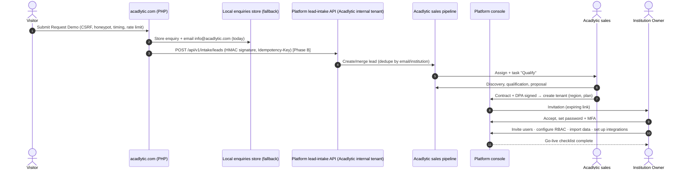

# 11 · Roadmap, conversion journey, risk register and ADRs

## 18. Development roadmap

Phases are **sequenced by dependency**, not calendar. Durations depend on team size and are estimated in sprint 0. Each phase has exit criteria, and features are marketed as LIVE only after they pass them (see `docs/CLAIMS_REGISTER.md`).

| Phase | Scope | Prerequisites | Exit criteria |
|---|---|---|---|
| **A: Foundation** | ADR confirmation; repo + CI/CD; environments (IaC); tenant model + RLS; identity (Argon2id, TOTP MFA, invitations, sessions); policy engine + permission catalogue; audit log; institution structure (campuses, departments, programs, terms); tenant settings; admin UI (users, roles, invitations); support-access grants; observability baseline; backups and restore test; CSV import framework | Cloud provider and region chosen; ADRs approved | Tenant-isolation suite green; RBAC matrix tests green; pen-test of auth/tenant boundary passed; restore test done; **no student data before this** |
| **B: Core CRM** | Leads, applicants and applications with stages; campaigns and sources; tasks, notes, timeline; students and guardians (guardian links + consent); documents (quarantine, scan, versions, signed downloads); email + in-app communications (templates, delivery logs, opt-outs); dashboards v1; Acadlytic's own sales CRM on an internal tenant (dogfooding) | Phase A; email provider contracted (sub-processor register + DPA) | First design-partner institution onboarded on real but limited data with signed DPA; DSR export works end to end |
| **C: Academic management** | Programs/courses/sections; timetables; attendance; assessments, grade entry, result publication with approval; faculty workspace; student and guardian portal v1 | Phase B (students) | Registrar-approved result-publication workflow; portal accessibility audit (WCAG 2.2 AA target) |
| **D: Finance + reporting** | Fee structures, invoices, concessions, receipts; payment gateway (hosted checkout) + reconciliation; SMS and WhatsApp channels; outbound webhooks; reports + scheduled exports (background jobs); analytics dashboards; read replica | Phase C (enrolments); payment gateway + SMS/WhatsApp providers contracted | Double-entry ledger reconciles to gateway settlements in test; export controls audited |
| **E: AI** | AI gateway, model router, prompt registry, AI audit + usage/quotas; AI Assistant (summaries, Q&A with citations); communication drafting; document classification/extraction (human-verified); segmentation suggestions; NL reporting over the semantic layer; rule-based automation with approvals | Phases B–D data; AI provider contracted with no-training terms; evaluation sets | Evaluations meet thresholds; red-team (prompt injection, cross-tenant) passed; human-approval rules enforced in tests |
| **F: Enterprise** | SSO (SAML/OIDC) + SCIM; WebAuthn; dedicated-DB tenant tier; regional deployment option; analytics warehouse; dedicated search; SIS/LMS/ERP connectors per demand; public API + developer docs; advanced compliance tooling (evidence automation, access reviews); SIEM integration; SOC 2-oriented readiness assessment | Stable `/api/v1`; enterprise demand | Independent audit only when controls have operated for the required period; no certification claimed before a report exists |

**Critical path:** A → B → (C and D partly in parallel once students exist) → E. AI (E) depends on real, well-structured data and on the audit and permission kernel from A.

## 17. Public website → SaaS conversion journey

| Step | Owner | System | Notes |
|---|---|---|---|
| Visitor explores platform and solution pages | Marketing | acadlytic.com | Analytics only if consent-compliant (currently no analytics cookies) |
| **Request Demo** | Visitor | `/company/request-demo/` form (CSRF, honeypot, rate limit) | Stored (MySQL/JSONL) + email to info@ today |
| **CRM lead** | System | Today: `enquiries` table + email. Phase B: marketing site posts a **signed webhook** (HMAC, timestamp, idempotency key) to the platform's lead-intake API on **Acadlytic's internal tenant** | The marketing site never gets DB credentials to the platform; retries with backoff; the local table remains the fallback |
| Qualification | Acadlytic sales | Acadlytic internal tenant (Admissions-style pipeline reused for B2B) | Discovery call, fit, security questionnaire |
| Institution account | Acadlytic | Platform console | Contract + DPA signed first |
| Tenant creation | Platform Super Admin | Provisioning workflow | Region, plan, feature flags; creates tenant, seeds role templates |
| Admin setup | Institution Owner (invited) | Tenant admin | MFA enforced at first login |
| User invitations | Institution Admin / HR | Invitations (role + scope required) | Expiring, single-use invite links |
| RBAC configuration | Institution Admin | Roles & assignments | Start from templates; custom roles from the catalogue |
| Data import | Institution Admin + Acadlytic onboarding | CSV import with dry run | Mapping templates; validation report; approval before apply |
| Integration setup | Institution Admin | Integrations | Email domain authentication, SSO (Phase F), payment gateway (Phase D) |
| Go-live | Both | Checklist | Access review, backup confirmation, support contacts, training |

## Risk register

| ID | Risk | Likelihood | Impact | Mitigation | Owner |
|---|---|---|---|---|---|
| R1 | Cross-tenant data exposure | Medium | Critical | RLS + app scope + isolation test suite + pen test | CTO |
| R2 | Broken object-level authorisation (IDOR) | Medium | High | Policy engine on every resource; generated authz tests; UUIDs | Tech lead |
| R3 | Privileged account takeover | Medium | Critical | Mandatory MFA, anomaly alerts, SSO for enterprise, session revocation | Security lead |
| R4 | Minors' data processed without valid guardian consent | Medium | High | Minor flag, guardian consent capture, restricted features for minors, legal review per market | DPO / Product |
| R5 | AI output treated as decision (bias, hallucination) | Medium | High | Human-approval rules, citations, evaluations, feature kill switches | AI lead |
| R6 | Tenant data sent to AI provider that trains on it | Low | Critical | Contract no-training terms, provider allow-list per tenant, sub-processor register | CTO / Legal |
| R7 | Over-engineering delays first value (microservices, k8s) | Medium | High | Modular monolith; stage gates in [10](10-infrastructure-operations.md) | CTO |
| R8 | Marketing claims outpace product | Medium | High | Claims register + QA gate; LIVE only with evidence | Product / Marketing |
| R9 | Reporting load degrades transactional performance | Medium | Medium | Background jobs, read replica, query budgets | Tech lead |
| R10 | Admissions-season traffic spikes | High | Medium | Autoscaling, queue buffering, load tests before seasons | DevOps |
| R11 | Messaging deliverability / regulatory blocks (DLT, WhatsApp policy) | Medium | Medium | Provider onboarding early, template registration, consent records | Product |
| R12 | Data residency requirement from EU/UK or other institutions | Medium | Medium | Region-aware deployment design; do not onboard without an in-region deployment | CTO |
| R13 | Payment reconciliation errors | Low | High | Double-entry ledger, gateway webhooks idempotent, daily reconciliation job | Finance lead |
| R14 | Backup exists but restore fails | Low | Critical | Quarterly restore tests with evidence | DevOps |
| R15 | Role explosion / misconfigured custom roles | Medium | Medium | Catalogue-only roles, access reviews, least-privilege templates | Product |
| R16 | Vendor lock-in to one cloud/AI provider | Medium | Medium | IaC, S3-compatible storage, AI provider adapters | CTO |
| R17 | Audit log tampering or loss | Low | High | Insert-only grants, hash chain, WORM archive | Security lead |
| R18 | Small team key-person risk | High | Medium | Docs (this pack), ADRs, runbooks, code review | CEO / CTO |

## 20. Architecture Decision Records

Status: **Proposed**. Each becomes *Accepted* after review in Phase A sprint 0. Format: context → decision → consequences.

| ADR | Decision | Context | Consequences |
|---|---|---|---|
| ADR-001 | Separate the public marketing site from the SaaS application | The site is live on PHP/cPanel and optimised for SEO; the SaaS needs stricter security and a different release cadence | Two deployables; website talks to the platform only via signed lead intake; login page hands off to `app.` |
| ADR-002 | Modular monolith (Laravel, PHP 8.3+) | Small team, PHP skills, need for transactional consistency across CRM/students/academics | Fast delivery; enforce module boundaries (namespaces, no cross-module DB writes, internal events); extraction candidates listed in [10](10-infrastructure-operations.md) |
| ADR-003 | PostgreSQL as system of record | RLS, JSONB, partitioning, FTS, pgvector | Managed Postgres; the website's MySQL remains only for website enquiries |
| ADR-004 | Shared DB + `tenant_id` + RLS; dedicated DB tier later | Cost and ops for MVP vs enterprise isolation | Composite FKs, `SET LOCAL app.tenant_id`, isolation tests; `tenant_db_routes` from day one |
| ADR-005 | React + TypeScript SPA on the same origin as the API | Authenticated app; API-first | Cookie sessions + CSRF for first party; OpenAPI contracts; Next.js not required |
| ADR-006 | RBAC with scoped assignments and one policy engine | Many roles, scopes (program, cohort, section), least privilege | Permission catalogue in code; no role checks in features; generated authz tests |
| ADR-007 | UUIDv7 primary keys | Non-guessable IDs, index locality, merge-friendly across tenants/DBs | Slightly larger keys; no sequential numbers exposed |
| ADR-008 | Append-only, hash-chained audit log | Accountability for sensitive data access | Insert-only role; partitioning; WORM archive at growth stage |
| ADR-009 | AI via a governed gateway; no autonomous consequential actions | Safety, tenant isolation, cost control, provider flexibility | All AI traffic through one module; human-approval workflow; evaluation gates |
| ADR-010 | Private object storage with scanning and signed, short-lived access | Sensitive student documents | Quarantine → clean pipeline; downloads always policy-checked and audited |
| ADR-011 | Redis for cache/sessions/queues (Horizon); managed queue later if needed | Simplicity for MVP | Tenant-prefixed keys; queue pools per workload at growth |
| ADR-012 | PostgreSQL FTS before a search cluster | Avoid second store and second isolation surface early | Revisit at Phase F with mandatory tenant filtering |
| ADR-013 | Managed containers in one region, IaC, no Kubernetes initially | Ops capacity; cost | Region chosen in sprint 0 (India region recommended for Indian institutions); multi-AZ HA |
| ADR-014 | Transactional outbox for events and webhooks | Reliable side effects | Relay worker; idempotent consumers; DLQ |
| ADR-015 | Channel adapters for email/SMS/WhatsApp/push | Provider choice not yet made; regulatory differences | Providers swappable; consent and suppression in core |
| ADR-016 | Institution = controller, Acadlytic = processor (default) | Standard SaaS model for education data | Contracts/DPA to confirm; DSR tooling routes decisions to the institution |
| ADR-017 | Compliance language: "designed to support", never "compliant/certified" without evidence | Honest claims policy | Claims register governs all copy; certifications only after reports exist |
