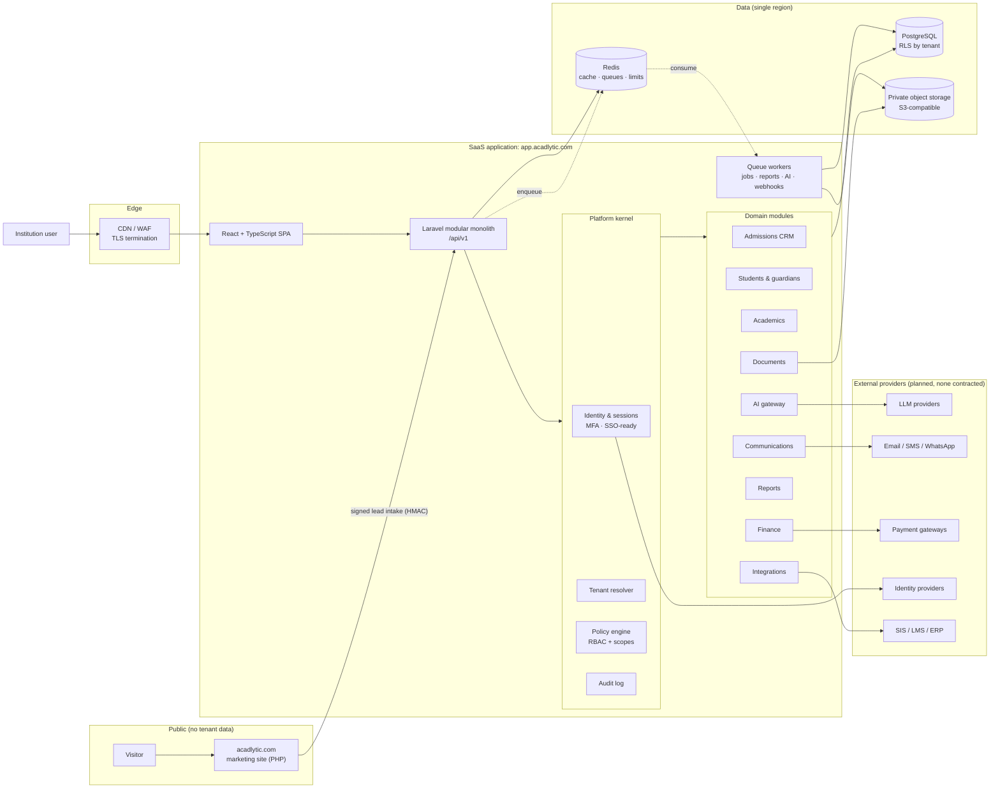

# Acadlytic Phase 3: platform architecture

**Acadlytic, Inc.**, *Where Education Meets Intelligence.* AI | CRM | CLOUD | ACADEMIC MANAGEMENT

| | |
|---|---|
| Status | **Proposed architecture.** A decision framework for review, not an implementation. |
| Date | 24/09/2026 |
| Scope | Public website, SaaS application, tenant administration, AI and analytics layer, platform infrastructure, security and compliance layer |
| Governance | Every capability is classified **LIVE / PLANNED / FUTURE**. Nothing here claims a live product capability, customer, certification or legal compliance. See [01 Product & capabilities](01-product-capabilities.md). |

## Documents

| # | Document | Deliverables covered |
|---|---|---|
| 00 | This page | 1. Executive architecture overview · final CTO review |
| 01 | [Product vision & capability matrix](01-product-capabilities.md) | Product vision, LIVE/PLANNED/FUTURE matrix |
| 02 | [Information architecture & UX](02-information-architecture.md) | 2. Public website sitemap · 3. SaaS sitemap · module rationale · frontend UX |
| 03 | [RBAC](03-rbac.md) | 4. Complete RBAC matrix · permission model · RBAC diagram |
| 04 | [Multi-tenancy](04-multi-tenancy.md) | 5. Multi-tenant architecture · tenant isolation diagram |
| 05 | [Data architecture](05-data-architecture.md) | 6. Database domain model · ER diagram · data flow diagram |
| 06 | [API & integrations](06-api-integrations.md) | 7. API architecture · 14. Integration architecture · integration diagram |
| 07 | [AI architecture](07-ai-architecture.md) | 8. AI architecture · AI diagram |
| 08 | [Security, privacy & audit](08-security-privacy.md) | 9. Security · 10. Privacy/compliance · audit logging · authentication diagram |
| 09 | [Documents, communications & reporting](09-documents-comms-reporting.md) | 11. Document architecture · 12. Communication · 13. Reporting · document flow diagram |
| 10 | [Infrastructure, observability & DR](10-infrastructure-operations.md) | 15. Infrastructure · 16. Observability · 17. Disaster recovery · scalability stages |
| 11 | [Roadmap, conversion journey, risks & ADRs](11-roadmap-risks-adrs.md) | 18. Roadmap · Request Demo → CRM flow · 19. Risk register · 20. ADRs |

---

## 1. Executive architecture overview

### Where Acadlytic is today

Acadlytic currently has a **pre-launch marketing website** (PHP 8.2+, cPanel, no build step). It has:
- 148 indexable pages;
- lead capture for demo, contact, enquiry and access requests, stored in MySQL or JSONL with an email notification;
- the “Talk to Acadlytic” contact widget;
- a sign-in shell that deliberately signs no one in.

**No SaaS product capability is live.** The website labels every product capability as *Planned · In development* (`docs/CLAIMS_REGISTER.md`).

### What we are designing

The design is a **multi-tenant, cloud-based EdTech CRM and academic management platform** for post-secondary institutions. It grows from a small, secure core (tenants, identity, RBAC, audit) into admissions CRM, student lifecycle, academics, finance, reporting and a governed AI layer, without a rewrite at any stage.

### Six separated layers

| Layer | What it is | Where it runs | Rule |
|---|---|---|---|
| 1. Public marketing website | acadlytic.com: SEO, content, lead capture | Current PHP site (cPanel now, any PHP host later) | Never holds tenant data. Talks to the platform only through a signed lead-intake API. |
| 2. SaaS application | `app.acadlytic.com`: the product institutions use | New application (Laravel modular monolith + React SPA) | Every request is authenticated, tenant-resolved and authorised. |
| 3. Institution/tenant administration | Tenant settings, users, roles, integrations, billing | Inside the SaaS app, behind admin permissions | Tenant admins manage their own tenant only. |
| 4. AI and analytics layer | AI gateway, retrieval, insights, reporting jobs | Module in the monolith with its own queue workers; extracted later if needed | Tenant-scoped context only. Human approval for high-impact actions. |
| 5. Platform infrastructure | Compute, PostgreSQL, Redis, object storage, queues, CI/CD, observability | Managed cloud services in a single region first | Managed services before self-hosting; no Kubernetes until justified. |
| 6. Security and compliance layer | Identity, RBAC, encryption, audit, privacy tooling, DR | Cross-cutting: the kernel of the monolith plus the cloud controls | Built in Phase A, before any student data is stored. |

### Headline decisions (details in the [ADRs](11-roadmap-risks-adrs.md#20-architecture-decision-records))

1. **Keep the marketing site separate** from the SaaS application.
2. **Modular monolith** (Laravel on PHP 8.3+) with strict module boundaries. No microservices at launch.
3. **PostgreSQL** as the system of record, with **Redis** for cache, queues and rate limits, and **S3-compatible private object storage** for files.
4. **Shared database, `tenant_id` on every tenant-owned row, enforced twice**: by an application-level tenant scope and by **PostgreSQL row-level security (RLS)**. Enterprise tenants can later move to a dedicated database without code changes.
5. **RBAC plus scoped grants** (role → permissions; assignment → scope: platform / tenant / department / program / cohort / student / record) through one policy engine. There are no role `if/else` checks in feature code.
6. **API-first**: the React SPA uses the same versioned `/api/v1/` contracts that will later become the public API.
7. **Governed AI gateway**: provider-agnostic, tenant-isolated retrieval, prompt registry, AI audit log, and human approval for consequential actions.
8. **Audit by default**: an append-only, tamper-evident audit log for security-relevant and sensitive-data events.

### System architecture

---

## 24. Final CTO review

### A. Recommended MVP architecture

- **One Laravel modular monolith** (API plus queue workers) and **one React SPA**, deployed as containers on a managed container service in **one cloud region**. For Indian institutions, an India region is recommended (see [Infrastructure](10-infrastructure-operations.md)).
- **Managed PostgreSQL**: automated backups, point-in-time recovery, encryption at rest, and **RLS enforced from day one**.
- **Managed Redis** for sessions, cache, rate limits and the job queue (Laravel Horizon).
- **Private S3-compatible object storage** for documents: per-tenant key prefixes, malware scanning, and short-lived signed downloads through the API only.
- **Identity:** email and password with Argon2id, TOTP MFA (mandatory for admin and finance roles), OIDC/SAML-ready abstractions, and invite-only onboarding.
- **Policy engine**, **audit log**, **tenant resolver** and **feature flags** belong in the kernel before any feature module.
- **CI/CD:** GitHub Actions running tests, static analysis, dependency and secret scanning, then migrations and deploy.
- **Observability:** structured logs, error tracking, uptime checks and basic metrics from the first deploy.

### B. What should NOT be built yet

- Microservices, Kubernetes, event streaming (Kafka), a data warehouse, multi-region active-active.
- A bespoke search cluster: PostgreSQL full-text and trigram search is enough for Phases A–C.
- Autonomous AI actions, predictive “at-risk” scoring used for decisions, or AI grading. Build suggestions and summaries first, and only after data quality and a fairness review.
- Native mobile apps: use a responsive web app and PWA first.
- A public developer API and marketplace: keep API contracts internal but versioned until Phase F.
- Schema-per-tenant or database-per-tenant for every customer: offer a dedicated database only as an enterprise tier (Phase F).
- Custom payment processing or card storage: use a PCI-compliant gateway with hosted fields.
- Direct SMS/WhatsApp carrier integrations: use established providers through an adapter.

### C. Critical security risks

1. Cross-tenant data exposure through a missing tenant filter. Mitigation: RLS plus the app scope, tenant-isolation tests in CI, and tenant-scoped cache and storage keys.
2. Broken object-level authorisation (IDOR) on student records and documents. Mitigation: the policy engine on every resource, and non-sequential IDs.
3. Account takeover of admin, finance or registrar staff. Mitigation: MFA mandatory for privileged roles, anomaly alerts, and SSO for enterprise.
4. Malicious uploads (malware, polyglot files). Mitigation: quarantine bucket, scanning, type allow-list and re-encoding of images.
5. Secrets exposure in code or CI. Mitigation: a secrets manager, secret scanning and short-lived credentials.
6. Prompt injection through documents or messages reaching AI tools. Mitigation: the AI gateway treats retrieved content as data, tools are permission-checked, and high-impact actions need approval.

### D. Critical privacy risks

1. **Minors' data.** Some applicants and students may be under 18, which triggers guardian-consent requirements under several laws, including the India DPDP Act. Guardian consent must be captured and evidenced.
2. **Purpose creep.** Admissions marketing data reused for unrelated profiling. Mitigation: purpose tags on data and consent records per channel.
3. **Retention without policy.** The design depends on institution-defined retention schedules, which do not yet exist.
4. **Cross-border transfers** to AI or messaging sub-processors. Mitigation: region pinning, DPAs, and a sub-processor register (none contracted yet).
5. **Role confusion.** The institution is normally the controller (data fiduciary) and Acadlytic the processor. The contracts must say so; this needs a legal decision.

### E. Critical scalability risks

1. Reporting and exports competing with transactional traffic. Mitigation: background jobs from day one, then a read replica, then a warehouse.
2. Noisy-neighbour tenants in a shared database. Mitigation: per-tenant rate limits, queue fairness and query budgets, with a dedicated-DB tier for large tenants.
3. Admissions-season spikes (application deadlines, results day). Mitigation: autoscaling stateless containers, queue buffering and load tests before each season.
4. Unbounded audit and communication-log growth. Mitigation: time partitioning and archival to object storage.

### F. RBAC risks

- Role explosion when institutions request bespoke roles. Mitigation: permission bundles plus tenant custom roles built from the fixed permission catalogue; no custom code.
- Over-broad default roles. Mitigation: least-privilege defaults, quarterly access reviews, and an access-review export.
- Scope errors (for example, a counsellor seeing every program). Mitigation: scoped assignments, and policy tests for every permission × scope.
- Platform staff access to tenant data. Mitigation: none by default; time-boxed, tenant-approved support access with full audit.

### G. AI risks

- Hallucinated facts in communications or reports. Mitigation: grounded retrieval with citations, human review before sending, and evaluation sets.
- Bias in risk or recommendation models affecting students. Mitigation: no automated consequential decisions, fairness evaluation per cohort, and explanations.
- Tenant data leaking into another tenant's context, or into provider training. Mitigation: per-request tenant-filtered retrieval, and provider terms that exclude training (to be contracted).
- Cost blow-outs. Mitigation: per-tenant quotas, usage metering and model routing.

### H. Multi-tenancy risks

- A missing `tenant_id` predicate, especially in raw SQL, reports and background jobs. Mitigation: RLS fails closed, and jobs carry the tenant context explicitly.
- Cache or search index keys without a tenant. Mitigation: mandatory key prefixing and a lint rule.
- Shared sequences or IDs leaking volumes. Mitigation: UUIDv7 identifiers.
- Migrating a tenant to a dedicated database later. Mitigation: a tenant-to-connection routing table from day one.

### I. Estimated architecture maturity

| Area | Today (website) | After Phase A (target) |
|---|---|---|
| Product capability | 0/5: no SaaS capability live | 1/5: foundation only |
| Security foundations | 3/5 for the website: CSP, CSRF, sessions, rate limits, audit table design | 3/5 for the platform: MFA, RBAC, RLS, audit, secrets manager |
| Multi-tenancy | 0/5 | 3/5: shared DB with RLS and isolation tests |
| Observability | 1/5: server logs only | 3/5: logs, errors, metrics, uptime, alerts |
| Compliance readiness | 1/5: approved website legal pages; no platform controls | 2/5: controls designed to support frameworks, with evidence collection started |
| Overall | **Level 1: pre-product** | **Level 2: secure foundation** |

The scale is a simple 0–5 self-assessment for planning only, not an external rating.

### J. Recommended next implementation step

Run **Phase A, sprint 0**:
1. Confirm the ADRs in this pack and pick the cloud provider and region.
2. Create the application repository with the kernel skeleton: tenant resolver, identity with MFA, policy engine with the permission catalogue from [03 RBAC](03-rbac.md), and the audit log.
3. Add PostgreSQL RLS migrations and a **tenant-isolation test suite** that runs in CI before any domain module exists.
4. Build **Admin setup + tenant creation + user invitations** as the first vertical slice. It exercises every kernel component end to end.

No student data should be stored until the Phase A exit criteria in [11 Roadmap](11-roadmap-risks-adrs.md) pass.
